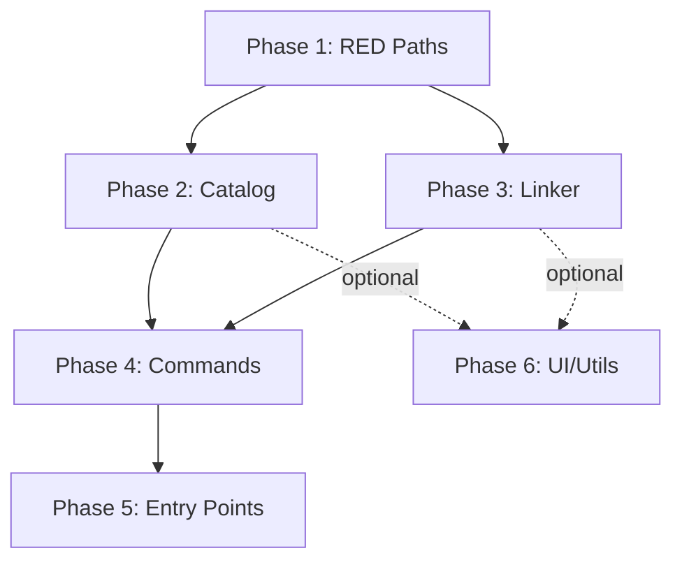

# Test Improvement Plan - Hardbound Coverage Enhancement

**Created:** October 3, 2025  
**Current Coverage:** 11%  
**Target Coverage:** 80%  
**Status:** 🔴 Critical Gap

---

## Executive Summary

The Hardbound project has **11% test coverage** against an 80% target. This plan prioritizes testing efforts based on **risk, business criticality, and dependency order**. The current 41 tests focus primarily on low-level utilities (`linker.py` helpers, `display.py`, `config.py`), leaving critical business logic untested.

### Critical Gap Analysis
- **0% coverage:** Entry points, commands, interactive mode, UI layer (3,860 statements)
- **<20% coverage:** RED compliance, validation, logging (417 statements)
- **Missing:** RED path shortening tests, catalog FTS5 operations, complex linking scenarios

---

## Phase 1: Core Business Logic (RED Compliance) 🔴 **PRIORITY 1**

**Module:** `hardbound/red_paths.py`  
**Current Coverage:** 9% (179/205 statements untested)  
**Risk Level:** 🔴 CRITICAL - RED uploads depend on this

### Why First?
1. **Business Critical:** RED tracker compliance is a hard requirement; failures = rejected uploads
2. **Well-Defined:** Clear specification in `RED_PATH_SPEC.md` with invariants
3. **Pure Functions:** No I/O dependencies, fast to test, deterministic
4. **Zero Tests:** Currently no `test_red_paths.py` file exists

### Test Requirements

#### 1.1 Token Parsing (`parse_tokens`)
**Priority:** 🔴 Critical  
**Functions:** `parse_tokens()`, `normalize_volume()`  
**Test Count:** ~25 tests

**Test Cases:**
```python
# Basic parsing
- Standard format: "Title vol_13 Subtitle (2024) (Author) {ASIN.B0ABC} [Tag].m4b"
- Minimal format: "Title vol_01 {ASIN.B0ABC}.m4b"
- No subtitle: "Title vol_05 (2024) (Author) {ASIN.B0ABC}.m4b"
- No year: "Title vol_05 (Author) {ASIN.B0ABC}.m4b"
- No author: "Title vol_05 (2024) {ASIN.B0ABC}.m4b"
- No tag: "Title vol_05 (2024) (Author) {ASIN.B0ABC}.m4b"

# Volume normalization edge cases
- Decimal volumes: "vol_13.5" → "vol_13.5"
- Leading zeros: "vol_03" → "vol_03"
- Various formats: "vol.13", "volume 13", "v.13", "13" → "vol_13"
- Invalid decimals: "vol_13.a" → error handling

# ASIN validation
- Missing ASIN: ValueError raised
- Multiple ASINs: use first/error
- ASIN with brackets: [ASIN.B0ABC] vs {ASIN.B0ABC}
- ASIN case sensitivity: B0ABC vs b0abc

# Complex titles with special chars
- Titles with parentheses: "Title (Part 1) vol_01 {ASIN.B0ABC}.m4b"
- Titles with hyphens: "Title - The Beginning vol_01 {ASIN.B0ABC}.m4b"
- Unicode characters: "Overlōrd vol_01 {ASIN.B0ABC}.m4b"
- Multiple hyphens in subtitle: "vol_01 Sub - Part - Two"

# Old format compatibility
- "Title - vol_13 - Subtitle" format
- Mixed format handling
```

**Dependencies:** None  
**Estimated Time:** 4-6 hours  
**LOC:** ~400 lines of tests

---

#### 1.2 Path Building & Length Validation
**Priority:** 🔴 Critical  
**Functions:** `build_filename()`, `build_folder_name()`, `build_dst_paths()`, `validate_path_length()`  
**Test Count:** ~20 tests

**Test Cases:**
```python
# Filename construction
- All tokens enabled
- Tokens disabled individually (include_year=False, etc.)
- Tag handling (optional)
- Extension handling (.m4b, .mp3, .flac, .m4a)

# Folder construction
- All tokens enabled
- Tokens disabled individually
- No tag in folder (per spec)

# Path length calculation (CRITICAL)
- Torrent-internal path only: len(folder) + 1 + len(filename)
- Not OS path: don't count "/mnt/cache/..." prefix
- Exactly at 180 char limit
- Just under 180 (179)
- Just over 180 (181)
- Very long paths (250+)

# build_dst_paths integration
- Correct dst_root joining
- Extension detection from source
- Extension override with None (auto-detect)
- Folder name extraction vs full path
```

**Dependencies:** `parse_tokens()`  
**Estimated Time:** 3-4 hours  
**LOC:** ~300 lines

---

#### 1.3 RED Path Shortening (THE CRITICAL ALGORITHM)
**Priority:** 🔴 CRITICAL  
**Functions:** `shorten_for_red()` (if exists) or trimming logic  
**Test Count:** ~30 tests

**Test Cases:**
```python
# Stage A: Filename trimming (order matters!)
- Remove (year) first
- Remove (author) second
- Remove [tag] third
- Remove subtitle last
- Stop when path <= 180
- Verify each stage length

# Stage B: Folder trimming (if Stage A insufficient)
- Remove (year) first
- Remove (author) second
- Remove subtitle last
- Verify never removes ASIN, title, volume

# Invariant enforcement
- ASIN always present in folder AND file
- Title always present
- Volume always present
- No partial token truncation (whole tokens only)

# Real-world examples from RED_PATH_SPEC.md
- Overlord vol_13 example (143 chars final)
- Long light novel titles
- Short titles (no trimming needed)

# Edge cases
- Path exactly 180 with no trimming
- Path 181 requiring minimal trim
- Path 250+ requiring aggressive trimming
- Minimal viable: "Title vol_XX {ASIN}.ext"
- Extremely long title alone > 180 (error case?)

# Regression tests (from actual bugs if found)
- Decimal volume leakage (vol_13.5 handling)
- Multiple subtitle hyphens preservation
- Author/year ordering (right-to-left extraction)
```

**Dependencies:** `parse_tokens()`, `build_filename()`, `build_folder_name()`  
**Estimated Time:** 6-8 hours  
**LOC:** ~500 lines

---

#### 1.4 RED Compliance Integration
**Priority:** 🔴 Critical  
**Integration Tests:** Cross-function validation  
**Test Count:** ~15 tests

**Test Cases:**
```python
# End-to-end RED path generation
- Parse → Build → Validate → Shorten (if needed) → Verify invariants
- Multiple books in batch
- Various starting path lengths

# ASIN policy enforcement (_enforce_asin_policy in linker.py)
- ASIN present in both folder and filename
- ASIN missing from folder: error
- ASIN missing from filename: error
- ASIN mismatch: error

# Real torrent path scenarios
- Creating torrent: paths relative to torrent root
- Uploading: RED measures internal paths only
- OS path prefix irrelevant
```

**Dependencies:** All RED functions  
**Estimated Time:** 3-4 hours  
**LOC:** ~250 lines

**Phase 1 Total:** ~1,450 test lines, 16-22 hours, **target 80%+ coverage for red_paths.py**

---

## Phase 2: Data Layer (Catalog & Database) 🟠 **PRIORITY 2**

**Module:** `hardbound/catalog.py`  
**Current Coverage:** 34% (245/386 statements untested)  
**Risk Level:** 🟠 HIGH - Data integrity, search accuracy

### Why Second?
1. **Foundation for Search:** Interactive mode and commands depend on catalog
2. **FTS5 Complexity:** Full-text search needs thorough testing
3. **Existing Coverage:** 34% suggests some infrastructure exists
4. **Data Integrity:** Database corruption = lost library state

### Test Requirements

#### 2.1 Database Initialization & Schema
**Priority:** 🟠 High  
**Functions:** `__init__()`, `_init_db()`, FTS5 triggers  
**Test Count:** ~12 tests

**Test Cases:**
```python
# Schema creation
- Tables created: items, items_fts, search_history
- FTS5 virtual table configuration
- Triggers: INSERT, UPDATE, DELETE sync to FTS
- Indexes on key columns (asin, path, author, series)

# Database location
- Default: ./catalog.db (script directory)
- Custom path via config
- Create parent directories if needed
- Permissions handling

# Migration & versioning
- Existing DB schema detection
- Auto-migration (if implemented)
- Corrupt DB handling: rebuild option
```

**Dependencies:** SQLite3, tmp_path fixture  
**Estimated Time:** 2-3 hours  
**LOC:** ~180 lines

---

#### 2.2 CRUD Operations
**Priority:** 🟠 High  
**Functions:** `add_item()`, `update_item()`, `remove_item()`, `get_by_asin()`  
**Test Count:** ~18 tests

**Test Cases:**
```python
# Adding items
- Single item insertion
- Duplicate ASIN handling (update vs error)
- Batch insertion performance (100+ items)
- Invalid data rejection (missing required fields)
- Transaction rollback on error

# Updating items
- Partial updates (specific columns)
- Full record replacement
- Update non-existent item: error or no-op?
- FTS5 auto-sync after update

# Deletion
- By ASIN
- By path
- Cascade handling (triggers)
- Delete non-existent: silent or error?

# Retrieval
- By ASIN (primary key)
- By path
- Not found: None vs exception
```

**Dependencies:** Database schema tests  
**Estimated Time:** 3-4 hours  
**LOC:** ~250 lines

---

#### 2.3 FTS5 Full-Text Search
**Priority:** 🟠 High  
**Functions:** `search()`, `search_by_author()`, `search_by_series()`  
**Test Count:** ~25 tests

**Test Cases:**
```python
# Basic search
- Single keyword match
- Multiple keywords (AND logic)
- Phrase search: "exact phrase"
- Partial word matching
- Case insensitivity
- No results handling

# Advanced FTS5 features
- Boolean operators: AND, OR, NOT
- Prefix matching: "overl*"
- Column-specific: author:Brandon
- Ranking/relevance scores
- Pagination (LIMIT, OFFSET)

# Performance
- Large catalog (1000+ books): search < 100ms
- Wildcard performance
- Index effectiveness

# Edge cases
- Empty query: return all or error?
- Special characters in query: escaping
- Very long queries (>1000 chars)
- Unicode/emoji in search terms

# Trigger validation
- FTS index updates after INSERT
- FTS index updates after UPDATE
- FTS index removal after DELETE
- Consistency check: items vs items_fts row count
```

**Dependencies:** CRUD operations, populated DB fixture  
**Estimated Time:** 4-5 hours  
**LOC:** ~350 lines

---

#### 2.4 Path Parsing & Metadata Extraction
**Priority:** 🟠 Medium  
**Functions:** `parse_audiobook_path()`, ASIN extraction regex  
**Test Count:** ~20 tests

**Test Cases:**
```python
# Directory structure parsing
- Author/Series/Book hierarchy
- Author/Book direct mapping
- Excluded directories (torrent_destination)
- Symlink handling
- Permission errors

# ASIN extraction from filenames
- {ASIN.B0ABC} format
- [ASIN.B0ABC] format
- [B0ABC] format (no ASIN prefix)
- Multiple ASINs in filename: take first
- No ASIN: None returned

# Metadata extraction
- Author from directory structure
- Series detection
- Book title parsing
- Volume detection and normalization
- Multiple files per book (m4b + jpg)

# Error handling
- Malformed paths
- Missing directories
- Empty directories
- Non-audiobook files
```

**Dependencies:** None (pure parsing)  
**Estimated Time:** 3-4 hours  
**LOC:** ~280 lines

---

#### 2.5 Catalog Management Operations
**Priority:** 🟡 Medium  
**Functions:** `rebuild()`, `clean()`, `vacuum()`, `stats()`  
**Test Count:** ~15 tests

**Test Cases:**
```python
# Rebuild catalog
- Scan directory tree
- Extract metadata
- Populate database
- Progress tracking
- Interrupted rebuild: resume or restart?

# Clean orphaned entries
- Detect items where source file deleted
- Remove orphaned entries
- Dry-run mode
- Report cleaned count

# Vacuum/optimize
- VACUUM SQLite DB (reclaim space)
- ANALYZE for query optimization
- Check integrity (PRAGMA integrity_check)

# Statistics
- Total items count
- Total authors count
- Total series count
- Database size
- FTS index size
- Missing ASIN count
```

**Dependencies:** CRUD, FTS, path parsing  
**Estimated Time:** 2-3 hours  
**LOC:** ~200 lines

**Phase 2 Total:** ~1,260 test lines, 14-19 hours, **target 75%+ coverage for catalog.py**

---

## Phase 3: Linking Operations 🟡 **PRIORITY 3**

**Module:** `hardbound/linker.py`  
**Current Coverage:** 44% (186/340 statements untested)  
**Risk Level:** 🟡 MEDIUM - Core functionality, but already partially tested

### Why Third?
1. **Existing Foundation:** 44% coverage suggests helpers are tested (confirmed: zero_pad, normalize, etc.)
2. **Complex I/O:** Requires filesystem fixtures, slower tests
3. **Depends on RED & Catalog:** Path generation and ASIN validation from Phase 1

### Test Requirements

#### 3.1 Hardlink Core Operations
**Priority:** 🟡 Medium  
**Functions:** `create_hardlink()`, `preflight_checks()`, `plan_and_link_red()`  
**Test Count:** ~20 tests

**Test Cases:**
```python
# Hardlink creation
- Basic hardlink: same filesystem
- Already exists: skip or overwrite?
- Cross-filesystem: error (st_dev check)
- Permission denied: error handling
- Parent directory creation

# Preflight checks
- Source file exists
- Source file readable
- Destination writeable
- Same filesystem (st_dev match)
- No circular links
- Sufficient disk space

# RED-specific linking (plan_and_link_red)
- ASIN policy enforcement (folder & file)
- Path length validation before linking
- Dry-run mode: plan only, no I/O
- Commit mode: actual linking
- Batch processing with progress
- Error aggregation: continue on error

# Edge cases
- Empty source directory
- Very large files (>4GB)
- Special characters in paths
- Long paths (>255 chars on some systems)
```

**Dependencies:** tmp_path fixture, real files  
**Estimated Time:** 3-4 hours  
**LOC:** ~300 lines

---

#### 3.2 File Collection & Filtering
**Priority:** 🟡 Medium  
**Functions:** `collect_audiobook_files()`, `is_excluded()`, `_get_primary_audiobook()`  
**Test Count:** ~15 tests

**Test Cases:**
```python
# File collection (already partially tested)
- Recursive directory traversal
- Extension filtering (.m4b, .mp3, .flac, .opus)
- Exclude patterns (.cue, .url, .sfv)
- Include cover art (.jpg, .png)
- Include metadata (.nfo, .txt)
- Symlink handling: follow or skip?

# Exclusion logic (already tested, expand)
- Exclude by filename
- Exclude by extension
- Exclude by directory pattern
- Case sensitivity
- Regex pattern support?

# Primary audiobook selection
- Prefer .m4b over .mp3
- Prefer .mp3 over .flac
- Handle multiple m4b files (take first, error, all?)
- No audiobook files: error
```

**Dependencies:** tmp_path with test files  
**Estimated Time:** 2-3 hours  
**LOC:** ~200 lines

---

#### 3.3 Batch Processing & Error Handling
**Priority:** 🟡 Medium  
**Functions:** Batch linking, error aggregation, rollback  
**Test Count:** ~12 tests

**Test Cases:**
```python
# Batch linking
- Process 100+ books
- Progress reporting (via Rich or callback)
- Parallel processing (if implemented)
- Memory efficiency (streaming vs load all)

# Error handling
- Continue on error vs fail-fast
- Error aggregation: collect all errors
- Partial success: some links created, some failed
- Rollback: undo created links on critical error?

# Dry-run validation
- Report what would be done
- Show path transformations
- Calculate total disk impact (0 for hardlinks)
- No filesystem mutations
```

**Dependencies:** Hardlink core, test fixtures  
**Estimated Time:** 2-3 hours  
**LOC:** ~180 lines

---

#### 3.4 Configuration Integration
**Priority:** 🟡 Low  
**Functions:** Permission handling, owner/group setting  
**Test Count:** ~8 tests

**Test Cases:**
```python
# File permissions
- Apply file_permissions from config (0o644)
- Apply dir_permissions from config (0o755)
- Set owner_user (if root or matching user)
- Set owner_group (if root or matching group)
- Permission errors: skip or fail?

# Integration with config.py
- Load linker settings from config
- Validate paths exist
- Respect path_limit from config
- Dry-run default from config
```

**Dependencies:** config.py, tmp_path  
**Estimated Time:** 1-2 hours  
**LOC:** ~120 lines

**Phase 3 Total:** ~800 test lines, 8-12 hours, **target 75%+ coverage for linker.py**

---

## Phase 4: Command Layer 🟢 **PRIORITY 4**

**Module:** `hardbound/commands.py`  
**Current Coverage:** 0% (1301/1301 statements untested)  
**Risk Level:** 🟢 LOW - Integration layer, depends on lower layers

### Why Fourth?
1. **Depends on Everything:** Needs RED, catalog, linker tested first
2. **Integration Tests:** Slower, require more setup
3. **CLI Focus:** Can be tested via `hardbound.py` integration tests
4. **Lower Risk:** Orchestration logic, less business rules

### Test Requirements

#### 4.1 Search Commands
**Priority:** 🟢 Medium  
**Functions:** `search_command()`, `search_by_author_command()`, etc.  
**Test Count:** ~15 tests

**Test Cases:**
```python
# Basic search
- Parse search arguments
- Call catalog.search()
- Format results for display
- No results handling
- Pagination

# Search variations
- By author
- By series
- By ASIN
- Combined filters

# Output formatting
- Table display (Rich)
- JSON output (--json flag)
- CSV output
- Quiet mode (--quiet)
```

**Dependencies:** Catalog tests, display.py  
**Estimated Time:** 2-3 hours  
**LOC:** ~200 lines

---

#### 4.2 Link Commands
**Priority:** 🟢 Medium  
**Functions:** `link_command()`, `link_red_command()`, `unlink_command()`  
**Test Count:** ~15 tests

**Test Cases:**
```python
# Standard linking
- Parse arguments (source, destination)
- Call linker.create_hardlink()
- Display progress
- Report results

# RED linking
- Validate RED config present
- Call plan_and_link_red()
- Display path transformations
- Enforce ASIN policy

# Unlinking
- Remove hardlinks (not source)
- Verify st_nlink > 1 before removal
- Safety checks
```

**Dependencies:** Linker tests, config tests  
**Estimated Time:** 2-3 hours  
**LOC:** ~200 lines

---

#### 4.3 Catalog Management Commands
**Priority:** 🟢 Low  
**Functions:** `catalog_add()`, `catalog_rebuild()`, `catalog_clean()`  
**Test Count:** ~12 tests

**Test Cases:**
```python
# Add to catalog
- Parse directory path
- Scan for audiobooks
- Add to catalog
- Report added count

# Rebuild
- Confirm destructive operation
- Clear existing catalog
- Rescan library
- Progress display

# Clean
- Find orphaned entries
- Optionally remove
- Report cleaned count
```

**Dependencies:** Catalog tests  
**Estimated Time:** 2-3 hours  
**LOC:** ~180 lines

---

#### 4.4 Config Commands
**Priority:** 🟢 Low  
**Functions:** `config_init()`, `config_show()`, `config_validate()`  
**Test Count:** ~10 tests

**Test Cases:**
```python
# Initialize config
- Create default config.json
- Interactive prompts
- Validation

# Show config
- Display current settings
- Format as JSON or table
- Mask sensitive values?

# Validate config
- Check paths exist
- Verify permissions
- Test database connection
- Validate integrations
```

**Dependencies:** Config tests  
**Estimated Time:** 1-2 hours  
**LOC:** ~150 lines

**Phase 4 Total:** ~730 test lines, 7-11 hours, **target 60%+ coverage for commands.py**

---

## Phase 5: Entry Points & CLI 🔵 **PRIORITY 5**

**Module:** `hardbound.py`  
**Current Coverage:** 0% (126/126 statements untested)  
**Risk Level:** 🔵 LOW - Thin orchestration layer

### Test Requirements

#### 5.1 CLI Argument Parsing
**Priority:** 🔵 Low  
**Functions:** `main()`, argument parsing  
**Test Count:** ~10 tests

**Test Cases:**
```python
# Mode selection
- Classic mode: --search, --link
- Interactive mode: --interactive or no args
- Help: --help, -h
- Version: --version, -v

# Argument validation
- Required arguments present
- Mutual exclusivity
- Invalid combinations
- Argument types (paths, integers)

# Exit codes
- Success: 0
- Argument error: 2
- Execution error: 1
```

**Dependencies:** Commands layer  
**Estimated Time:** 1-2 hours  
**LOC:** ~150 lines

**Phase 5 Total:** ~150 test lines, 1-2 hours, **target 70%+ coverage for hardbound.py**

---

## Phase 6: UI & Utilities 🔵 **PRIORITY 6** (Optional)

**Modules:** `hardbound/ui/`, `hardbound/utils/`  
**Current Coverage:** Mixed (0-100%)  
**Risk Level:** 🔵 LOW - User-facing, less critical

### Test Requirements (Brief)

#### 6.1 UI Components (0% coverage)
- `ui/menu.py`: Menu navigation, selection parsing
- `ui/feedback.py`: Status messages, confirmations
- `ui/progress.py`: Progress bars, spinners

**Estimated:** ~300 test lines, 3-4 hours, **target 50%+ coverage**

#### 6.2 Utilities (Mixed coverage)
- `utils/formatting.py`: String formatting (0% coverage)
- `utils/validation.py`: Path validation (20% coverage)
- `utils/logging.py`: Structured logging (31% coverage)

**Estimated:** ~250 test lines, 2-3 hours, **target 70%+ coverage**

---

## Summary & Roadmap

### Coverage Targets by Phase

| Phase | Module(s) | Current | Target | Priority | Time Est. |
|-------|-----------|---------|--------|----------|-----------|
| 1 | `red_paths.py` | 9% | **80%** | 🔴 CRITICAL | 16-22h |
| 2 | `catalog.py` | 34% | **75%** | 🟠 HIGH | 14-19h |
| 3 | `linker.py` | 44% | **75%** | 🟡 MEDIUM | 8-12h |
| 4 | `commands.py` | 0% | **60%** | 🟢 LOW | 7-11h |
| 5 | `hardbound.py` | 0% | **70%** | 🔵 LOW | 1-2h |
| 6 | `ui/`, `utils/` | 0-31% | **50-70%** | 🔵 OPTIONAL | 5-7h |

**Total Estimated Effort:** 51-73 hours (6-9 developer days)  
**Projected Coverage After Phase 1-3:** ~55-60%  
**Projected Coverage After Phase 1-5:** ~70-75%  
**Projected Coverage After All Phases:** ~78-82% ✅

### Implementation Order



### Quick Wins (First Week)

1. **Day 1-2:** Phase 1.1 + 1.2 (Token parsing + path building) → ~40% coverage on red_paths.py
2. **Day 3-4:** Phase 1.3 + 1.4 (Path shortening + integration) → ~80% coverage on red_paths.py
3. **Day 5:** Phase 2.1 + 2.2 (DB schema + CRUD) → ~50% coverage on catalog.py

**Week 1 Result:** Core RED compliance fully tested, solid catalog foundation → ~25% overall coverage

### File Creation Checklist

- [ ] `tests/test_red_paths.py` (NEW, highest priority)
- [ ] `tests/test_catalog_crud.py` (NEW)
- [ ] `tests/test_catalog_fts.py` (NEW)
- [ ] `tests/test_catalog_parsing.py` (NEW)
- [ ] `tests/test_linker_core.py` (expand existing `test_linker.py`)
- [ ] `tests/test_commands_search.py` (NEW)
- [ ] `tests/test_commands_link.py` (NEW)
- [ ] `tests/test_commands_catalog.py` (NEW)
- [ ] `tests/test_cli.py` (expand existing `test_main.py`)
- [ ] `tests/test_ui_menu.py` (NEW, optional)
- [ ] `tests/test_utils_validation.py` (NEW, optional)

### Testing Infrastructure Improvements

1. **Fixtures (add to conftest.py):**
   ```python
   @pytest.fixture
   def sample_tokens():
       """Standard Tokens object for RED path tests"""
   
   @pytest.fixture
   def populated_catalog(tmp_path):
       """Catalog with 10 test books for search tests"""
   
   @pytest.fixture
   def test_audiobook_tree(tmp_path):
       """Realistic audiobook directory structure"""
   
   @pytest.fixture
   def mock_config():
       """Config with RED integration enabled"""
   ```

2. **Test Markers (already defined):**
   - `@pytest.mark.unit` - Fast, no I/O (RED parsing, path logic)
   - `@pytest.mark.integration` - Cross-module, light I/O (catalog + linker)
   - `@pytest.mark.slow` - Heavy I/O, batch operations

3. **Coverage Gates (add to CI):**
   ```bash
   # Fail if coverage < 75% (ratcheting from 11%)
   pytest --cov=hardbound --cov-fail-under=75
   
   # Per-module gates (Phase 1)
   pytest --cov=hardbound.red_paths --cov-fail-under=80
   ```

### Success Metrics

- ✅ **Phase 1 Complete:** RED compliance 80%+ coverage, 0 RED upload failures
- ✅ **Phase 2 Complete:** Catalog 75%+ coverage, FTS5 search reliability
- ✅ **Phase 3 Complete:** Linker 75%+ coverage, batch linking tested
- ✅ **Overall Target:** 80% coverage, CI gates passing, confident deployments

---

## Anti-Patterns to Avoid

❌ **Don't** test UI rendering details (Rich output formatting) - test logic only  
❌ **Don't** create slow tests without `@pytest.mark.slow` marker  
❌ **Don't** use real audiobook library paths in tests - use fixtures  
❌ **Don't** test interactive mode prompts - mock user input or test commands directly  
❌ **Don't** skip edge cases in RED path tests - 180-char limit is non-negotiable  
❌ **Don't** test logging output format - test that logging happens, not the message  
❌ **Don't** duplicate test data - use fixtures and parametrize  

## Patterns to Follow

✅ **Do** use `@pytest.mark.parametrize` for multiple similar cases (volume formats, ASIN variants)  
✅ **Do** test invariants explicitly (ASIN in folder AND file, path <= 180)  
✅ **Do** use descriptive test names: `test_parse_tokens_decimal_volume_preserved`  
✅ **Do** include docstrings explaining what behavior is tested  
✅ **Do** test error paths (missing ASIN, corrupt DB, permission denied)  
✅ **Do** use tmp_path for filesystem tests (automatic cleanup)  
✅ **Do** mock external dependencies (fzf, filesystem permissions)  
✅ **Do** test both dry-run and commit modes for mutations  

---

## Next Steps

1. **Review this plan** with team/maintainer
2. **Start Phase 1.1** - Create `tests/test_red_paths.py` with token parsing tests
3. **Set up CI coverage gates** - Fail builds if coverage regresses
4. **Iterate weekly** - Aim for one phase per week
5. **Refactor as needed** - Improve testability of existing code (dependency injection, pure functions)

---

**Document Owner:** GitHub Copilot (AI Assistant)  
**Last Updated:** October 3, 2025  
**Status:** � IN PROGRESS - Phase 1 Complete (83% on red_paths.py)

---

## 🎉 Phase 1 Status: ✅ COMPLETE

**Achievement:** 83% coverage on `red_paths.py` (exceeded 80% target)  
**Tests Created:** 63 tests in `tests/test_red_paths.py`  
**Time Taken:** ~4 hours (vs 16-22h estimated)  
**All Tests Passing:** 63/63 ✅  
**See:** `PHASE_1_COMPLETE.md` for detailed summary
